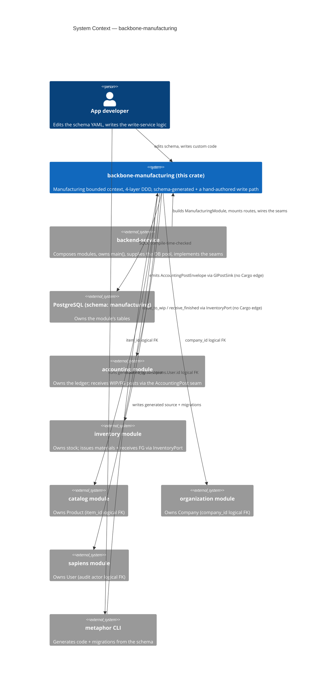
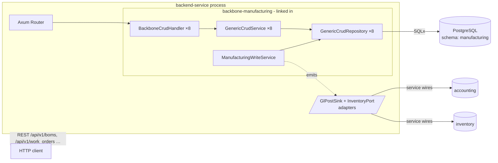
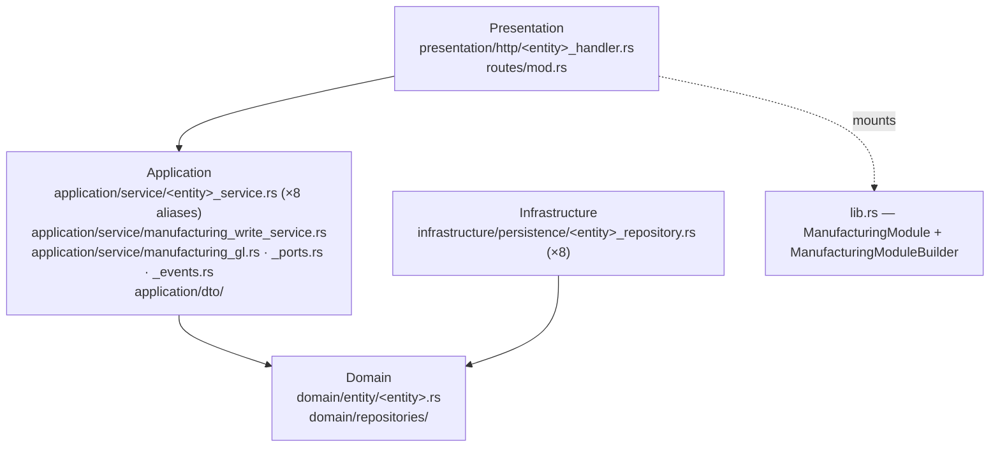
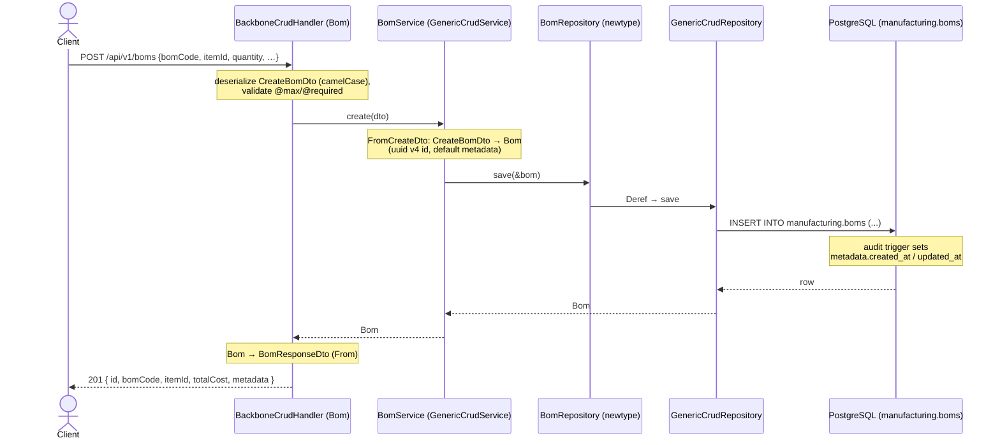
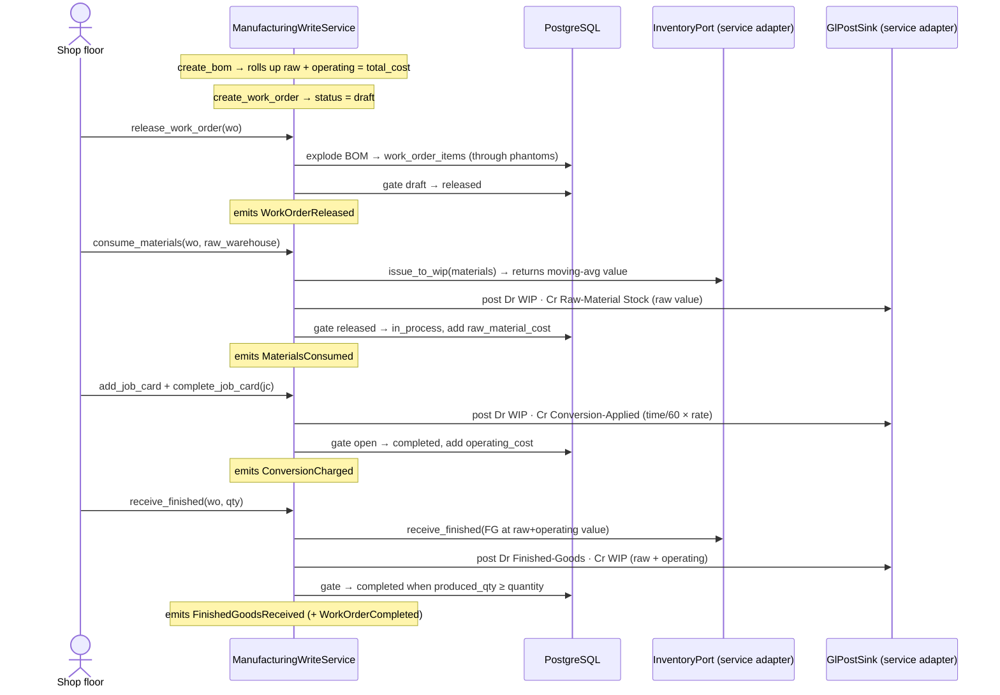

<!-- Reader: Maintainer · Mode: Explanation -->
# Architecture

`backbone-manufacturing` is a **library crate** that owns the manufacturing bounded context as four
DDD layers. It does not run on its own — a `backend-service` composes it, hands it a database pool,
and mounts its router. Everything in `src/` is either generated from the schema YAML or lives inside
a regen-safe custom region. This page shows the system top-down (C4), traces one generated CRUD
request end to end, then traces the domain's reason to exist — the **WIP/GL lifecycle** — through
`ManufacturingWriteService`.

The module's composition root is [`src/lib.rs`](../../src/lib.rs): the `ManufacturingModule` struct
and its `ManufacturingModuleBuilder`. (There is a leftover `src/module.rs` in the tree, but no `mod`
statement declares it, so it is **not compiled** — ignore it. The live root is `lib.rs`.)

## 1. Context

Who uses the module, and what it depends on. Manufacturing is one bounded context among the
Backbone ERP modules; it never imports the others' crates — cross-module ids are **logical FKs**.

*What to notice: the module is a **dependency**, never an entrypoint. It writes to accounting and
drives inventory **without a Cargo dependency on either** — it emits a serialized `AccountingPostEnvelope`
through a `GlPostSink` port and calls an `InventoryPort`, both implemented by the composing service.
Everything else it needs (products, companies, users, accounts, warehouses) is a logical FK, not a
copied-in table.*

## 2. Containers

The runnable pieces and how they talk. The module compiles into the service binary; there is no
separate manufacturing process.

*What to notice: the module contributes a `Router` the service **merges** — ordinary linked-in Rust,
no special runtime. The generated CRUD path (`handler → service → repo`) and the hand-authored
`ManufacturingWriteService` share the same pool. The WIP/GL logic reaches accounting and inventory
only through the **seam adapters the service provides**; the module ships zero normal Cargo edge to
either.*

## 3. Components / modules — the DDD 4-layer shape

Dependencies point **inward only**. Domain depends on nothing. The module has **eight entities**
across two schema models — `bom.model.yaml` (Workstation, Operation, Bom, BomItem, BomOperation)
and `work_order.model.yaml` (WorkOrder, WorkOrderItem, JobCard) — plus a hand-authored write path.

| Layer | Directory | Holds (in this module) | May depend on |
|-------|-----------|------------------------|---------------|
| **Domain** | `src/domain/` | The 8 entities (`Bom`, `WorkOrder`, `JobCard`, …), their typed ids, enums (`WorkOrderStatus`, `JobCardStatus`), and the repository **traits** (ports) | nothing |
| **Application** | `src/application/` | The 8 `…Service` type aliases over `GenericCrudService`; the Create/Update/Patch/Response DTOs; **the hand-authored seam** — `manufacturing_write_service.rs` (the WIP verbs), `manufacturing_gl.rs` (`GlPostSink` + `AccountingPostEnvelope`), `manufacturing_ports.rs` (`InventoryPort`), `manufacturing_events.rs` (`ManufacturingEvent`); `ServiceError`/`ServiceResult` | domain |
| **Infrastructure** | `src/infrastructure/` | The 8 repository newtypes over `GenericCrudRepository<Entity, SoftDelete>` | domain, application |
| **Presentation** | `src/presentation/`, `src/routes/` | `create_<entity>_routes()` wiring `BackboneCrudHandler` (12 endpoints each); read/write route splits; error → HTTP mapping | application |
| **Composition** | `src/lib.rs` | `ManufacturingModule` / `ManufacturingModuleBuilder`, `all_crud_routes()`, public re-exports | all layers (it is the root) |

A subtlety worth internalizing: for each entity there are **two repository types**. The domain layer
defines a repository `trait` (the *port* — the contract). The infrastructure layer defines a
`struct …Repository` newtype (the *adapter* — the Postgres implementation over `GenericCrudRepository`).

The hand-authored seam files (`manufacturing_*`) are **user-owned** — declared inside the
`// <<< CUSTOM` markers of [`application/service/mod.rs`](../../src/application/service/mod.rs) so
regeneration never removes their `mod`/`pub use` lines. See
[The manufacturing domain](09-manufacturing-domain.md) for what they do.

## 4. Data & control flow — `POST /api/v1/boms` end to end

Trace one generated CRUD create request, top to bottom and back. `Bom` is the recipe entity; this
is the plain generated path (no domain logic), identical in shape for all eight entities.

*What to notice:* four layers, but **only the schema-declared shapes cross them** — `CreateBomDto`
in, `Bom` through the middle, `BomResponseDto` out. Every conversion is generated. The
`created_at`/`updated_at` stamps are set by a **Postgres trigger**
([`…_add_audit_triggers.up.sql`](../../migrations/20260426220011_add_audit_triggers.up.sql)), not by
Rust — so audit timestamps hold even for writes that bypass the service.

> **Note on cost.** This *generic* create writes whatever `totalCost` the caller sends — it does
> **not** roll up cost from lines. The real cost roll-up (Σ component amounts + Σ operation costs)
> lives in the hand-authored `ManufacturingWriteService::create_bom`, not the generated handler. See
> [§4b](#4b-data--control-flow--the-wip-lifecycle) and the [domain page](09-manufacturing-domain.md).

### The twelve endpoints, for free

`create_bom_routes()` calls `BackboneCrudHandler::<…>::routes(service, "/boms")`. That single call
wires **all twelve** endpoints; you write none of them:

`list` · `create` · `get` · `update` · `patch` · `soft_delete` · `restore` · `empty_trash` ·
`bulk_create` · `upsert` · `find_by_id` · `list_deleted`

**Where the `/api/v1` prefix comes from.** `ManufacturingModule::all_crud_routes()`
([`lib.rs`](../../src/lib.rs)) merges the eight handler routers directly, so *by itself* it mounts
them **unprefixed** (`POST /boms`). The `/api/v1` version prefix is added by the composers in
[`src/routes/mod.rs`](../../src/routes/mod.rs) — `get_routes(&module)` does
`Router::new().nest("/api/v1", create_stateless_routes(&module))`. A service typically mounts the
`routes::get_routes` form, giving `POST /api/v1/boms`.

> ⚠️ **Guarded vs. unguarded — read this before deploying.** `all_crud_routes()` (and its
> `#[deprecated]` alias `routes()`) mount the **full unguarded** generic-CRUD surface: a well-formed
> request can create invalid rows or soft-delete a master out from under its dependents. For any real
> deployment, compose a **guarded** router — read routes open, writes behind validation/auth — using
> the `create_<entity>_read_routes()` / `create_<entity>_write_routes()` splits the handlers expose.
> The lib.rs doc comments say this explicitly; the deprecation on `routes()` is the reminder.

## 4b. Data & control flow — the WIP lifecycle

The generated CRUD above is table-stakes. The **reason this module exists** is the Work Order
lifecycle, hand-authored in
[`application/service/manufacturing_write_service.rs`](../../src/application/service/manufacturing_write_service.rs).
A Work Order's value flows through Work-In-Progress in **three balanced posts** and nets WIP to
**zero** on completion. This trace follows one WO from release to completion.

*What to notice:*

- **Three posts, WIP nets to zero.** `consume` charges WIP with raw-material value; `operate` charges
  WIP with conversion cost; `receive` credits all of it back out to finished goods. After a full
  receipt, WIP debits = WIP credits. This is the module's one provable invariant (ADR-001).
- **Side effects before the gate.** Each verb drives its idempotent side effects (inventory move, GL
  post) **first**, then commits its status-transition gate. A crash mid-saga leaves the WO in its
  prior state; a retry re-drives and dedups. `receive_finished` originally committed the gate first
  and could strand WIP non-zero on a failed receipt — corrected (ADR-001 §5, proven by revert).
- **Idempotency is structural.** Each post carries a stable `idempotency_key` and a derived
  `source_id` (v5 UUID), and the status transition is the once-only guard, so a retry never
  double-charges WIP.
- **Value comes from inventory, not the BOM.** `consume_materials` posts the value the `InventoryPort`
  reports (moving-average), not the BOM's planning rates. The BOM roll-up is for planning only.

The full domain narrative — master data vs execution, the cost roll-up formulas, the state machines,
and the account/warehouse wiring — is on the [manufacturing domain page](09-manufacturing-domain.md).

## Where persistence semantics come from

- **Soft delete** is structural: `config.soft_delete: true` in [`index.model.yaml`](../../schema/models/index.model.yaml)
  → `GenericCrudRepository<Entity, SoftDelete>` → `soft_delete`/`restore`/`empty_trash`/`list_deleted`
  operate on `metadata.deleted_at`. (The write-service reads `(metadata->>'deleted_at') IS NULL` to
  ignore soft-deleted rows.)
- **Audit** (`config.audit: true`) → the `metadata` JSONB column carrying `created_at`, `updated_at`,
  `deleted_at`, `created_by`, `updated_by`, `deleted_by`. Timestamps are trigger-managed; the `*_by`
  actor fields are logical FKs to `sapiens.User.id`.
- **Own schema per module** → migrations emit `CREATE SCHEMA manufacturing` and qualify tables as
  `manufacturing.<table>`, so two modules never collide on a table name.

## Key decisions

**Framework decisions** (this handbook's ADRs):

- [ADR-0001](adr/adr-0001-schema-yaml-ssot.md) — schema YAML is the single source of truth.
- [ADR-0002](adr/adr-0002-generic-crud.md) — services/repositories are generic, inherited not written.
- [ADR-0003](adr/adr-0003-custom-markers.md) — regen-safety via CUSTOM markers and `user_owned`.

**Domain decision** (separate series — see [`docs/adr/`](../adr/)):

- [ADR-001](../adr/ADR-001-manufacturing-boundary-and-wip-seam.md) — manufacturing's boundary and the
  WIP job-order costing seam: why it is a separate GL producer, the three-post invariant, and
  side-effects-before-gate idempotency.

---

Next: [Maintainer Guide](05-maintainer-guide.md) — how to add a feature without breaking the machine.
